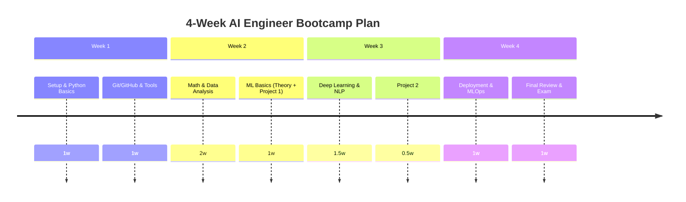

# AI Engineer Bootcamp

> A hands-on portfolio documenting my journey to become an AI Engineer through real-world projects and labs.  

[](LICENSE) 
 
 
 

## 📖 Table of Contents

- [Introduction](#introduction)  
- [AI Engineer Roadmap](#ai-engineer-roadmap)  
- [Repository Structure](#repository-structure)  
- [Tech Stack](#tech-stack)  
- [Learning Roadmap](#learning-roadmap)  
- [Machine Learning Projects](#machine-learning-projects)  
- [Deep Learning](#deep-learning)  
- [Computer Vision](#computer-vision)  
- [Natural Language Processing](#natural-language-processing)  
- [Generative AI](#generative-ai)  
- [MLOps / Deployment](#mlops--deployment)  
- [4-Week Study Plan](#4-week-study-plan)  
- [Progress Tracker](#progress-tracker)  
- [Certifications](#certifications)  
- [License](#license)  

---

## 📖 Introduction

Welcome! This **AI Engineer Bootcamp** repository is my personal learning portfolio for AI, Machine Learning, and Data Science. It includes structured lessons, projects, and notes covering: Python, statistics, machine learning (regression, classification, clustering), deep learning, computer vision, NLP, generative AI, and MLOps. Each section/project has a clear workflow, code, and documentation. The goal is to demonstrate practical skills from data analysis to deploying AI models.

---

## 🚀 AI Engineer Roadmap

This is my planned path to proficiency:

- **Programming:** Master Python syntax, OOP, libraries.  
- **Math & Stats:** Learn linear algebra, calculus basics, probability, and statistics.  
- **Data Analysis:** Practice with pandas, NumPy, data visualization (Matplotlib/Seaborn).  
- **Machine Learning:** Supervised (regression/classification), unsupervised (clustering), model evaluation (ROC-AUC, cross-validation).  
- **Deep Learning:** Neural networks (ANN, CNNs, RNNs/LSTMs), transfer learning.  
- **Computer Vision:** Image classification, object detection, OCR techniques.  
- **Natural Language Processing:** Text cleaning, tokenization, embeddings, transformers (BERT, GPT).  
- **Generative AI:** Large language models, prompt engineering, RAG (Retrieval-Augmented Generation).  
- **MLOps / Deployment:** Docker, FastAPI/Flask, CI/CD, MLflow, and cloud platforms (AWS/Azure/GCP).  

Each item above corresponds to dedicated sections and projects in this repo.

---

## 📂 Repository Structure

The repo is organized chronologically by topic. Here’s the high-level layout:

```text
AI-Engineer-Bootcamp/
├── README.md         # This file
├── 01-Python/        
├── 02-Statistics/    
├── 03-Data-Analysis/ 
├── 04-Machine-Learning/
│   ├── AutoPricePrediction/
│   ├── FlightPricePrediction/
│   ├── HomeLoanDefault/
│   └── HospitalStayPrediction/
├── 05-DeepLearning/  
├── 06-ComputerVision/
├── 07-NLP/           
├── 08-GenerativeAI/  
├── 09-MLOps/         
├── 10-Deployment/    
├── datasets/         # shared data files
├── notebooks/        # Jupyter notebooks for demos
└── docs/             # (future: detailed markdown docs)
```

Each numbered folder contains tutorial notebooks and code for that topic. The project folders under Machine Learning contain end-to-end solutions to capstone problems. 

---

## 🛠 Tech Stack

- **Languages:** Python 3.x (primary), Bash  
- **Data & ML:** NumPy, pandas, Scikit-Learn, XGBoost, LightGBM, CatBoost  
- **Deep Learning:** TensorFlow 2.x, Keras, PyTorch  
- **NLP:** HuggingFace Transformers, spaCy, NLTK  
- **CV:** OpenCV, YOLOv5, Detectron2  
- **MLOps/Deployment:** Docker, MLflow, DVC, FastAPI, Streamlit/Gradio  
- **Cloud & Tools:** AWS (EC2, S3, SageMaker), Azure, GCP, Git/GitHub, VS Code  

We also use libraries like Matplotlib/Seaborn for visualization, and GitHub Actions for CI/CD badges. 

---

## 📖 Learning Roadmap

Below is a high-level study checklist. Check off items as you master them:

- **Python & Fundamentals**  
  - [x] Syntax, data types, control flow  
  - [ ] Functions, OOP, modules  
  - [ ] Advanced features (decorators, generators)  

- **Mathematics & Statistics**  
  - [ ] Linear algebra (matrices, eigenvectors)  
  - [ ] Calculus basics (derivatives)  
  - [ ] Probability & distributions (Normal, Bayes)  
  - [ ] Statistical tests (hypothesis testing)  

- **SQL & Databases**  
  - [ ] Basic queries (SELECT, JOIN)  
  - [ ] Advanced SQL (CTEs, Window functions)  
  - [ ] NoSQL fundamentals (MongoDB)  

- **Data Analysis**  
  - [ ] Data cleaning/EDA (pandas)  
  - [ ] Missing values, outlier handling  
  - [ ] Feature engineering & dimensionality reduction  

- **Machine Learning**  
  - [ ] Regression (linear, polynomial, regularized)  
  - [ ] Classification (logistic, trees, SVM, ensemble)  
  - [ ] Clustering (k-means, hierarchical)  
  - [ ] Model evaluation (cross-val, ROC, confusion matrix)  

- **Deep Learning**  
  - [ ] Neural networks (activation, backprop, optimizers)  
  - [ ] CNNs (image conv layers, pooling)  
  - [ ] RNNs/LSTM (sequence data)  
  - [ ] Transformers (self-attention, BERT, GPT)  

- **Computer Vision**  
  - [ ] Image classification workflows  
  - [ ] Object detection (YOLO, SSD)  
  - [ ] Image segmentation basics  
  - [ ] OCR (text extraction)  

- **Natural Language Processing**  
  - [ ] Text preprocessing (tokenize, stem, lemmatize)  
  - [ ] Embeddings (Word2Vec, BERT vectors)  
  - [ ] Sentiment analysis, NER, topic modeling  
  - [ ] Transformer-based NLP (fine-tuning GPT/BERT)  

- **Generative AI & LLMs**  
  - [ ] Prompt engineering techniques  
  - [ ] Building a RAG system (vectors + LLM)  
  - [ ] AI agents and multi-step chains (LangChain)  

- **MLOps & Deployment**  
  - [ ] Containerization (Docker images)  
  - [ ] API development (FastAPI/Flask)  
  - [ ] CI/CD pipelines (GitHub Actions)  
  - [ ] Experiment tracking (MLflow, DVC)  

This roadmap is dynamic – items will be checked off as projects are completed.

---

## 💻 Machine Learning Projects

Below are capstone project summaries. Click each to expand details:

<details>
<summary>🚗 **Auto Price Prediction**</summary>

**Goal:** Predict used car prices using regression.  
**Key tasks:** EDA, data cleaning, feature engineering, model training (Linear, Random Forest, XGBoost), hyperparam tuning, comparison.  
**Checklist:**  
- [x] Exploratory Data Analysis (stats, visualization)  
- [x] Handle missing values/outliers  
- [x] Create features (age, mileage, brand encoding)  
- [x] Train regression models & tune hyperparameters  
- [x] Evaluate models (RMSE, R²)  
- [x] Derive business insights (pricing factors)  

</details>

<details>
<summary>✈️ **Flight Price Prediction**</summary>

**Goal:** Predict airline ticket prices from flight metadata.  
**Key features:** Airline, source, destination, stops, date/time.  
**Checklist:**  
- [x] Date-time feature engineering (day, month, time)  
- [x] Encode categorical data (Airline, Location)  
- [x] Regression models (Linear, RF, XGBoost)  
- [ ] Fine-tune best model  
- [ ] Analyze price influencers  

</details>

<details>
<summary>🏦 **Home Loan Default Prediction**</summary>

**Goal:** Classify whether a customer will default on a loan.  
**Key tasks:** Data preprocessing, handling class imbalance, feature importance, model comparison.  
**Checklist:**  
- [x] Clean data and handle missing values  
- [x] Encode categorical variables (marital status, etc.)  
- [x] Address imbalance (SMOTE or weighted loss)  
- [x] Train classifiers (Logistic, RF, XGBoost)  
- [ ] Evaluate (ROC-AUC, precision/recall)  

</details>

<details>
<summary>🏥 **Hospital Stay Prediction**</summary>

**Goal:** Predict length of hospital stay from patient info.  
**Key tasks:** Feature selection, encoding, regression models, error analysis.  
**Checklist:**  
- [x] Data analysis (check skew, distributions)  
- [x] Encode categorical (disease type, gender)  
- [x] Train regressors (Linear, RF, Gradient Boosting)  
- [ ] Analyze high-error cases (medicine, severity)  

</details>

*More projects (deep learning, CV, NLP) are in progress or coming soon.* 

---

## 🧠 Deep Learning

*(In development)* Implementations of neural networks (ANNs, CNNs, RNNs). E.g.:

- Image classifiers using CNN (MNIST, CIFAR-10)  
- NLP with RNN/LSTM on text data  
- Transfer learning with pre-trained models  

Check back for completed notebooks and writeups.

---

## 👁 Computer Vision

*(In development)* Projects for visual tasks:

- Image classification (Cats vs Dogs, etc.)  
- Object detection (YOLOv5 on custom data)  
- Semantic segmentation (using U-Net)  
- OCR pipelines  

Future sections will include datasets, model code, and results.

---

## 💬 Natural Language Processing

*(In development)* Text-based projects:

- Spam detection, sentiment analysis (classic ML/NLP pipelines)  
- Transformers: fine-tune BERT/GPT for classification or QA  
- Named Entity Recognition demos  
- Prompt engineering exercises with OpenAI APIs  

Will include code and evaluation metrics once done.

---

## 🤖 Generative AI / LLMs

*(In development)* Emphasizing large language models and agents:

- Building a Retrieval-Augmented Chatbot (LLM + vector DB)  
- Multi-step agent with LangChain (tool use)  
- Fine-tuning a small GPT model on domain data  
- Vector database experiments (FAISS, ChromaDB, Pinecone)  

Planned demos and write-ups to follow.

---

## ⚡ MLOps & Deployment

*(In development)* Tools and practices:

- Containerizing ML apps with Docker  
- Creating APIs (FastAPI) for model inference  
- CI/CD with GitHub Actions  
- Experiment tracking (MLflow dashboards)  
- Model monitoring concepts  

Detailed examples to be added.

---

## 📈 4-Week Study Plan

Below is a high-level schedule using a Mermaid timeline (GitHub renders Mermaid charts natively):



Plan tasks at the start of each week and adjust as needed. This timeline shows key milestones.

---

## 📊 Progress Tracker

| **Topic**              | **Status**       |
|------------------------|------------------|
| Python Basics          | ✅ Completed     |
| Statistics & Math      | ✅ Completed     |
| SQL & Databases        | 🟨 In Progress    |
| Data Analysis (EDA)    | ✅ Completed     |
| Machine Learning       | 🟨 In Progress    |
| Deep Learning          | ⬜ Not Started   |
| Computer Vision        | ⬜ Not Started   |
| NLP                    | ⬜ Not Started   |
| Generative AI / LLMs   | ⬜ Not Started   |
| MLOps / Deployment     | ⬜ Not Started   |

Progress is updated as I complete sections. (Green=done, Yellow=in progress, White=not started.)

---

## 🏆 Certifications

- IBM AI Engineering Professional Certificate  
- Google Data Analytics Certificate  
- Microsoft Azure AI Engineer Associate  
- DeepLearning.AI TensorFlow Developer  
- OpenAI Ambassador (community recognition)  

*(Add links or badge images if desired.)*

---

## 📜 License

This bootcamp portfolio is licensed under the MIT License. See [LICENSE](LICENSE) file for details.

---

## 🎨 Color Palette (Example)

For best readability, use a consistent theme. Example palettes:

- **Light Theme:** Background `#FFFFFF`, text `#333333`, accent `#2563EB`.  
- **Dark Theme:** Background `#0D1117`, text `#C9D1D9`, accent `#58A6FF`.  

Adjust badges and images to match your chosen palette.

---

## 🛠️ Implementation

To apply this README:

1. Copy this Markdown into your `README.md`.  
2. Update sections with your details, links, and any images.  
3. Verify links and diagrams render correctly on GitHub.  
4. Commit and push to your repo.

```bash
git add README.md
git commit -m "Add polished AI Engineer Bootcamp README"
git push
```

Congratulations! Your `README.md` should now present a clean, interactive, and comprehensive overview of your AI Engineer Bootcamp portfolio.

```  

